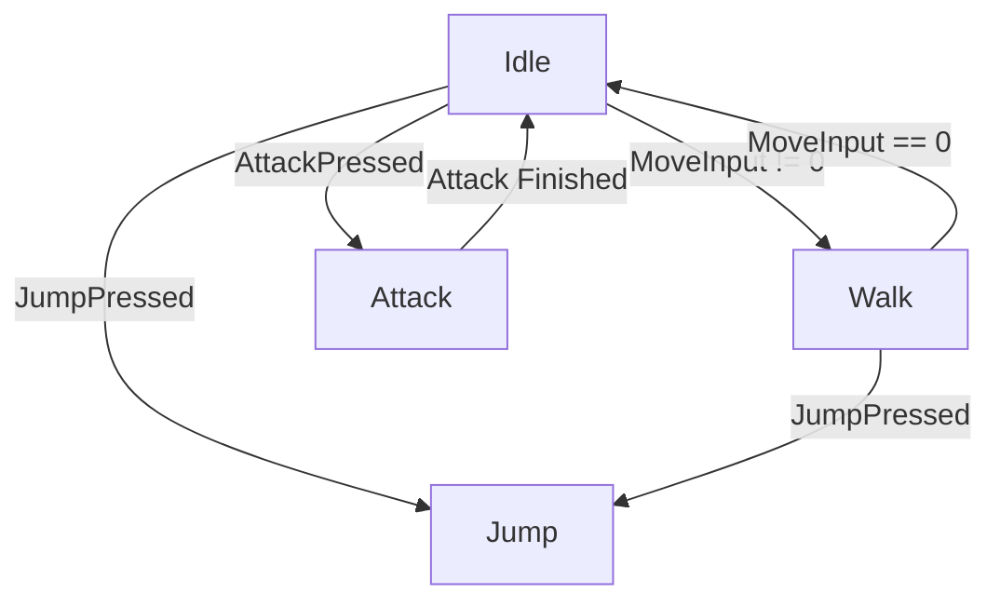

# ⚙️ Hierarchical Finite State Machine (HFSM) Framework – Unity

A scalable **Hierarchical Finite State Machine (HFSM)** gameplay framework for Unity designed with **AAA game architecture principles**.
This project demonstrates how to structure complex character behavior using **clean separation of concerns, transition graphs, and modular state logic**.

The system is designed to be **extensible, testable, and maintainable**, making it suitable for both small prototypes and large gameplay systems.

---

# 🚀 Features

✔ Hierarchical Finite State Machine (HFSM)
✔ Data-driven transition system
✔ Shared **Context / Blackboard architecture**
✔ Transition graph builder (clean FSM construction)
✔ Zero monolithic "God classes"
✔ Modular state behavior
✔ Extensible gameplay framework

---

# 🧠 Why HFSM?

As games grow, player behavior becomes complex:

```
Idle
Walk
Jump
Attack
Crouch
Sprint
Block
Roll
```

If implemented in a single script:

```csharp
if (Input.GetKeyDown(KeyCode.Space))
{
    Jump();
}
```

The result is a **large, tightly coupled PlayerController**.

HFSM solves this by organizing behavior into **independent states** with a clear hierarchy.

---

# 🏗 Architecture Overview

The system is divided into four layers:

```
Unity Layer
   ↓
Controller (MonoBehaviour)
   ↓
HFSM State Machine
   ↓
State Graph
   ↓
Individual States
```

---

# 🧩 Core Components

## 1️⃣ HFSMContext

A **shared data container** (Blackboard pattern) used by all states.

Responsibilities:

* Store gameplay data
* Provide Unity component references
* Decouple states from Unity APIs

Example data:

```
Rigidbody2D
Animator
MoveInput
JumpPressed
AttackPressed
IsGrounded
```

States read/write from this context instead of directly accessing Unity systems.

---

## 2️⃣ HFSMStateMachine

The central system that:

* tracks the current state
* evaluates transitions
* switches states

Execution loop:

```
Unity Update
   ↓
machine.Tick()
   ↓
CheckTransitions()
   ↓
ChangeState()
   ↓
CurrentState.Tick()
```

---

## 3️⃣ HFSMState

Base class for all states.

Each state implements three core lifecycle functions:

```
Enter() → called when state starts
Tick()  → called every frame
Exit()  → called when leaving state
```

Example:

```
IdleState
WalkState
JumpState
AttackState
```

---

## 4️⃣ HFSMTransition

Transitions define **when a state should change**.

Example:

```
Idle → Walk  (MoveInput != 0)
Walk → Idle  (MoveInput == 0)
Idle → Jump  (JumpPressed)
```

Transitions are defined using conditions:

```csharp
idle.AddTransition(walk, () => context.MoveInput != 0);
```

---

## 5️⃣ FSMGraphBuilder

Instead of building the FSM inside the controller, a **Graph Builder** constructs the state graph.

Responsibilities:

```
Create states
Connect transitions
Set initial state
Return configured machine
```

Controller usage:

```csharp
machine = FSMGraphBuilder.Build(context);
```

This keeps Unity code clean and separates **framework logic from gameplay logic**.

---

# 🔁 State Hierarchy

The project demonstrates **Hierarchical FSM structure**:

```
RootState
   │
GroundedState
   ├── IdleState
   ├── WalkState
   └── AttackState
   │
   └── JumpState
```

Hierarchy allows shared behavior.

Example:

```
GroundedState
   handles "leave ground → jump"
```

Instead of duplicating this logic in:

```
IdleState
WalkState
AttackState
```

---

# 📊 State Transition Graph



---

# 📂 Project Structure

```
Assets
 ├── HFSM
 │
 │   ├── Core
 │   │   ├── HFSMState.cs
 │   │   ├── HFSMStateMachine.cs
 │   │   ├── HFSMTransition.cs
 │   │   ├── HFSMContext.cs
 │   │   └── FSMGraphBuilder.cs
 │   │
 │   ├── States
 │   │   ├── RootState.cs
 │   │   ├── CharacterState.cs
 │   │   ├── GroundedState.cs
 │   │   ├── IdleState.cs
 │   │   ├── WalkState.cs
 │   │   ├── JumpState.cs
 │   │   └── AttackState.cs
 │   │
 │   └── Unity
 │       └── CharacterControllerFSM.cs
```

---

# 🎮 Demo Scene Setup

1️⃣ Create a **Player object**

Add components:

```
Rigidbody2D
BoxCollider2D
Animator
CharacterControllerFSM
```

2️⃣ Create a **Ground object**

```
Sprite (Square)
BoxCollider2D
```

3️⃣ Configure Rigidbody

```
Gravity Scale → 3
Freeze Rotation → Z
```

---

# ⌨ Controls

```
A / D        → Move
Space        → Jump
Left Click   → Attack
```

---

# 🧩 Design Principles

The architecture follows several industry practices:

### Command Separation

States only contain **behavior**, not system logic.

### Context Pattern

Shared gameplay data is centralized.

### Graph Construction

FSM structure defined in a **single builder class**.

### Hierarchical Behavior

Parent states handle shared logic.

---

# 🔍 Future Improvements

This framework is designed to support additional gameplay features such as:

* State Debug Visualizer
* ScriptableObject State Graphs
* Input System Integration
* Ability Systems
* Network Rollback Support
* AI State Machines

---

# 📚 Learning Goals

This project demonstrates how to implement:

```
Hierarchical Finite State Machines
Gameplay architecture patterns
Transition graph systems
Context-based data sharing
Modular behavior design
```

It is intended as both a **learning resource and gameplay framework prototype**.

---

# 📜 License

MIT License

Feel free to use and extend this framework for personal or commercial projects.

---

# ⭐ If You Found This Useful

Consider starring the repo or using it as a base for your own gameplay architecture experiments.
